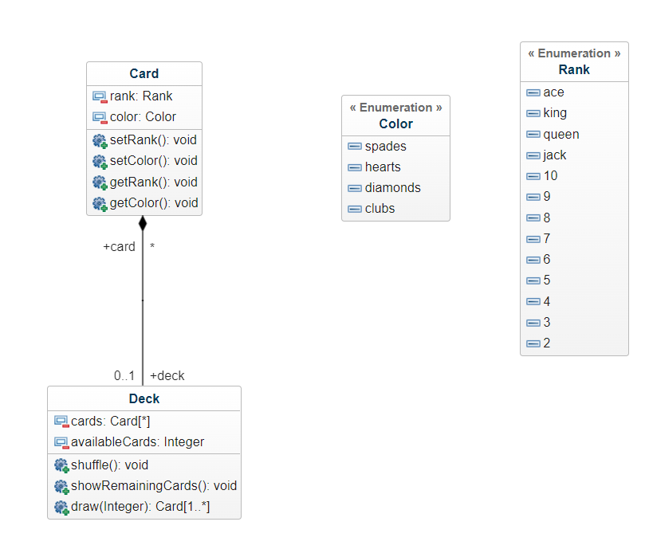
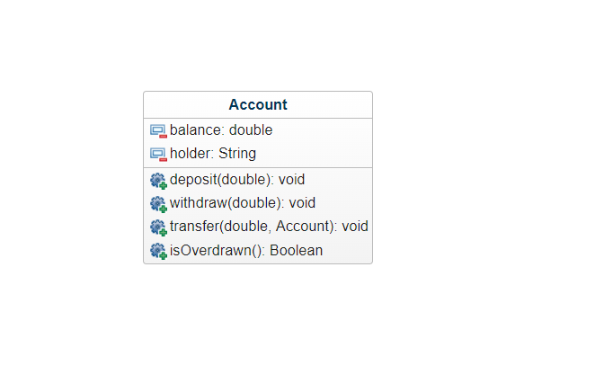
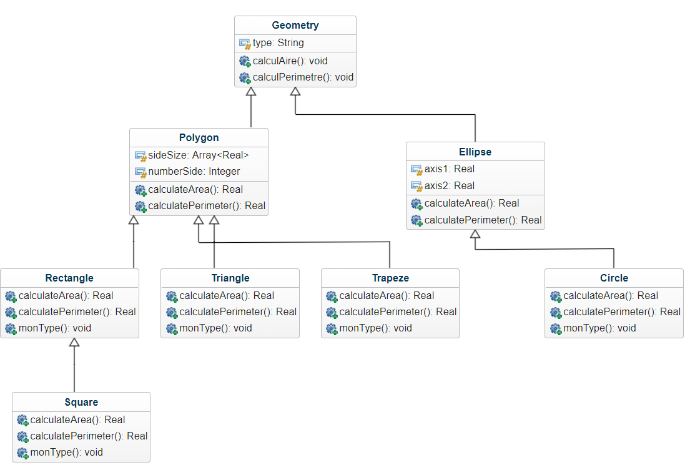
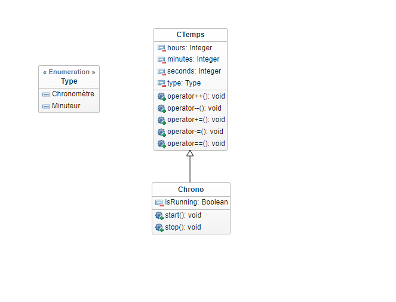
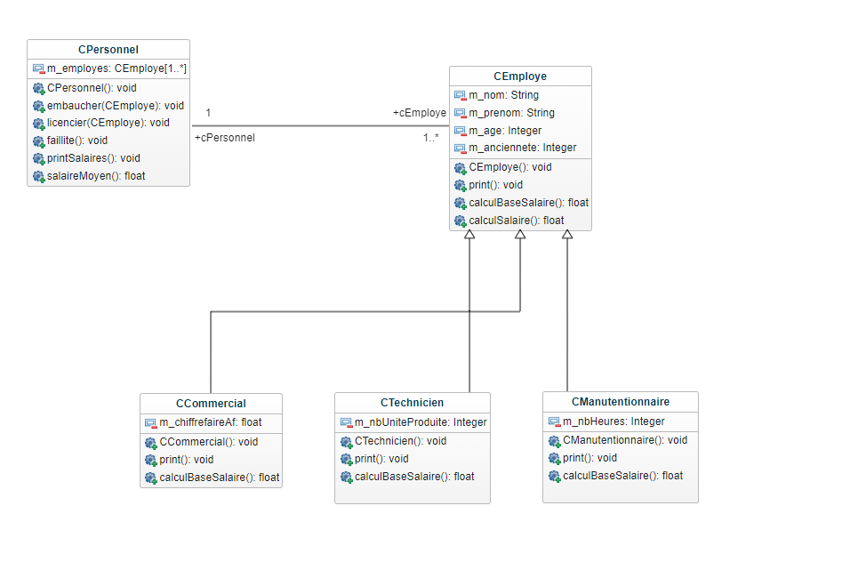
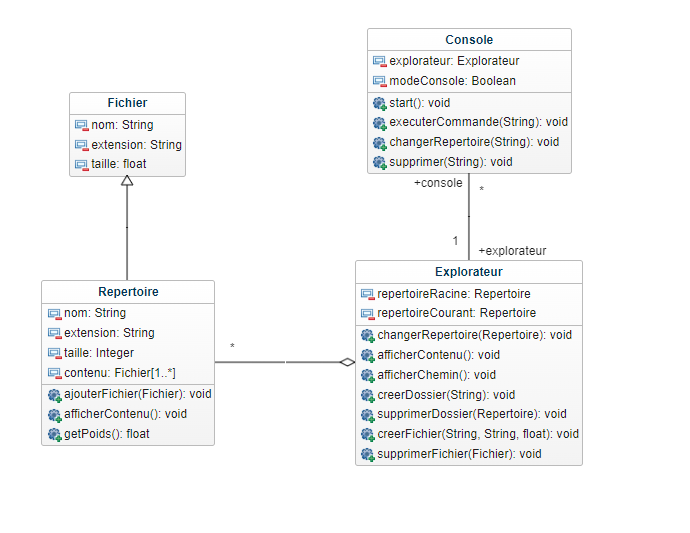

# POO TD

Vous trouverez ici tous les td de POO que l'on a pu menés pendant les cours.

Dans chaque dossier, vous trouverez le diagramme de classe UML ainsi que le code en JAVA. Vous pouvez compiler le code afin de l'exécuter.

### TD 01 - Jeu de cartes

### TD 01 - Compte Banque

### TD 01 - Geometrie

### TD 01 - Chronomètre

### TD 02 - Employé

### TD 03 - Système de fichiers

